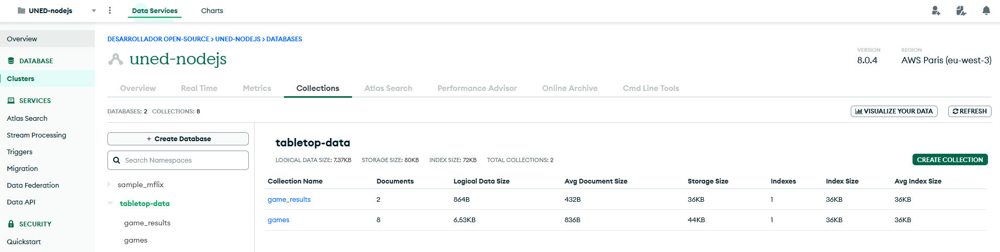

# Fuente de datos - MongoDB

Para el almacenamiento, usamos una base de datos NoSql de MongoDB.

Los datos que usa esta aplicación se podrían modelar perfectamente en una SQL, pero el uso de NoSql supone un reto adicional para mi porque nunca antes había trabajado con ella, pero sí en bases de datos como SQL Server.

## Proveedor de MongoDB

Por sencillez, se opta por usar el servicio de la nube con opción gratuita [MongoDB Atlas](https://cloud.mongodb.com/)

## Clúster

Para la base de datos, se crea un clúster, que en este caso fue compartido con otros proyectos del Máster. Dentro del clúster, se crea una base de datos dedicada para el catálogo de juegos.

## Colecciones

Únicamente se necesitan dos colecciones para esta aplicación

* `games`: almacena los juegos, cada uno en un documento separado.
* `game_results`: almacena los resultados de las partidas de los juegos, donde cada documento es una partida con `gameId` que lo relaciona con el juego.

## Permisos

Se usa un usuario genérico con acceso a lectura escritura a la colección

## Seguridad de acceso

El clúster tiene protección de acceso por IP, de manera que las únicas IPs permitidas son:

* IP de desarrollo: la dirección IP desde donde se ejecuta la aplicación de desarrollo.
* IP de la máquina EC2: IP de la máquina alojada en AWS donde se encuentra la aplicación de producción.