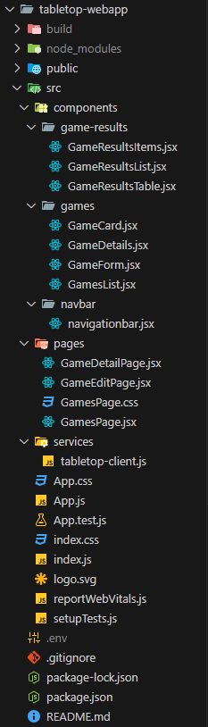

# Estructura y programación del frontend

En esta sección describiremos la organización del proyecto `tabletop-webapp`.

La siguiente imagen recoge el directorio del proyecto



## Dependencias

Como dependencias, a parte de las habituales de un proyecto de react, se requieren:

* `axios`: cliente http para realizar las solicitudes al backend de express.
* `@mui/material`: Componentes gráficos Material UI para agilizar la composición de la web.

## Carpeta Services

Son los "servicios" de la aplicación, entendidos como las dependencias que necesita transversal a la aplicación. Básicammente sólo se necesita uno, donde se implmenta el acceso a datos.

### Servicio `tabletop-client.js`
El servicio [/services/tabletop-client.js](https://github.com/bportelalp/master-webdev-uned/blob/main/8-mod-tfm/tabletop-webapp/src/services/tabletop-client.js) es el servicio que permite el acceso a datos. Se comporta como una capa de abstracción de axios, permitiendo formalizar los métodos de forma más sencilla para realizar las consultas.

Todos los metodos funcionan de forma asíncrona. Los métodos disponibles son:

```js
export default {
    getGames,
    getImgUri,
    getGame,
    createGame,
    updateGame,
    updateGameImage
}
```

A continuación, se muestra un ejemplo del método `getGame`.

```js

const getGame = async (gameId) => {
    const uri = `${URI}/api/games/${gameId}`;

    try {
        const resp = await axios.get(uri);
        return resp.data;
    } catch (error) {
        // Si el error es un 404, devolver null, porque el juego no existe
        if (error.response && error.response.status === 404) {
            return null;
        }

        console.log('Error on', uri, error);
        throw new Error(error.message);
    }
}
```

## Carpeta Components

Son componentes de react que se usan a lo largo de la aplicación, modularizando los diferentes elementos.

Se pueden consultar en el siguiente enlace: [Components](https://github.com/bportelalp/master-webdev-uned/tree/main/8-mod-tfm/tabletop-webapp/src/components)

## Carpeta pages

Son componentes de react igual que los anteriores, pero por favorecer la claridad, son aquellos que se usarán en el enrutado del sitio.

Se pueden consultar en el siguiente enlace: [Pages](https://github.com/bportelalp/master-webdev-uned/tree/main/8-mod-tfm/tabletop-webapp/src/pages)

## Páginas

En el archivo [App.js](https://github.com/bportelalp/master-webdev-uned/blob/main/8-mod-tfm/tabletop-webapp/src/App.js) definimos las rutas que tiene la aplicación:

```jsx
<BrowserRouter>
   <NavigationBar />
   <Routes>
     <Route path='/' element={<GamesPage/>} />
     <Route index path='/games' element={<GamesPage/>} />
     <Route index path='/game/:gameId' element={<GameDetailPage />} />
     <Route index path='/game/edit' element={<GameEditPage />} />
     <Route index path='/game/edit/:gameId' element={<GameEditPage />} />
     <Route path="*" element={<GamesPage/>}/>
   </Routes>
   {/* <Home></Home> */}
 </BrowserRouter>
```

* Raíz y `/games`: Lista de juegos de catálogo.
* `/game/:gameId`: Detalles del juego con id el proporcionado en la ruta.
* `/game/edit`: Formulario de creación de nuevo juego.
* `/game/edit/:gameId`: Formulario de edición del juego con id el de la ruta proporcionada.