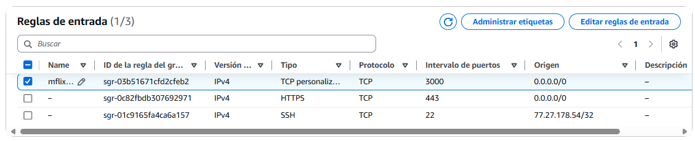

# Deploy en EC2 de AWS

La aplicación se puede hospedar en una instancia EC2 de Amazon Web Services. 

Los pasos a llevar a cabo son los mismos que los que se han visto en la asignatura de *Despliegue de aplicaciones de node.js*. A continuación se detallan los pasos a seguir:

## Preparar la Instancia EC2.

Para crear una instancia de EC2, desde la consola de administración de AWS:

1. Acceder al módulo EC2.
2. Lanzar una nueva instancia. La configuración escogida es:
      - Plantilla Amazon Linux 2023.
      - Arquitectura x64 (x86).
      - Tipo de instancia t2.medium vCPU y 4 GB RAM.
      - Par de claves. Crear una nueva, descargando el archivo `ParDeClaves.pem` para la futura conexión SSH.
      - Reglas de tráfico permitidas solo para equipo de trabajo.
      - Almacenamiento básico de 8 GB.
3. Una vez creada la instancia, podremos conectarnos desde un terminal SSH.

Para la conexión con SSH, se puede usar desde windows directamente la consola de `powershell`.

```powershell
ssh user@ipAddress -i "RutaCarpetaParDeClaves\ParDeClaves.pem"
```
donde el usuario es típicamente `ec2-user` y la direccion IP debe usarse la IPv4 pública de la instancia.

### Instalar el software necesario

Dentro de la instancia, necesitamos al menos git y node instalado.

Para git:

```bash
sudo yum install git
```

Esto nos permitira traer el repositorio de códgo donde tenemos la aplicación.

Para instalar node.js, la opcion tomada es a través de *Node Version Manager*.

```bash
curl -o- https://raw.githubusercontent.com/nvm-sh/nvm/v0.39.7/install.sh | bash
source ~/.bashrc
```

Con esto tendremos `nvm` listo para usar. Ahora obtenemos e instalamos la ultima LTS de node.js

```bash
nvm install --lts
```

## Configurar el Clúster de MongoDB Atlas para que permita la conexión

Para permitir el acceso desde la instancia EC2, únicamente deberemos permitir la conexión a MongoDB Atlas autorizando la dirección IP de EC2.

Tenemos que ir a `Security` > `Network Access` y añadir una nueva dirección IP a la lista de permitidos

## Desplegar la aplicación

Con todo listo, en lo que sigue usaremos la ventana de `powershell` conectada a nuestra instancia EC2 para preparar el despliegue de la aplicación.

### Obtener los archivos

Primero deberemos de descargar el repo del código fuente.

```bash
mkdir projects
cd projects
git clone https://github.com/bportelalp/master-webdev-uned.git
```

Este repositorio personal tiene todo el código del Máster, pero sólo necesitamos las carpetas que contienen el TFM

```bash
cd master-webdev-uned
mv 8-mod-tfm/tabletop-api ~/projects/
mv 8-mod-tfm/tabletop-webapp ~/projects/
```

Después nos colocamos en la carpeta base de nuestra aplicación, desde allí necesitaremos instalar todas las dependencias de node

```bash
cd projects/tabletop-api
npm install
cd projects/tabletop-webapp
npm install
```

### Hacer el *build* de la aplicación de react.

Para la aplicación de node, necesitamos conseguir el build, como se ha descrito en [la sección anterior](1-express-host.md#compilar-aplicación-de-react).

```bash
cd projects/tabletop-webapp
npm run build
```

### Configurar las variables de entorno de la aplicación de express

Debemos crear un fichero .env para añadir la cadena de conexión a mongoDb junto con otros ajustes que no se suelen subir al repositorio público, en la aplicación de express.

El siguiente snippet muestra todos los ajustes necesarios en el archivo `.env` para nuestro aplicativo de node.js. Concretamente la variable `FOLDER_HOSTED_WEBAPP` es la que hace referencia a dónde está el `build` de la aplicación de react.

```text
MONGO_DB = mongodb+srv://<username>:<password>@uned-nodejs.isihe.mongodb.net/?retryWrites=true&w=majority&appName=uned-nodejs
FOLDER_HOSTED_WEBAPP = '~/tabletop-webapp/build'
FOLDER_IMAGES_TEMP = 'public/uploads'
FOLDER_IMAGES = 'public/games'
FOLDER_IMAGES_ALLOWED_TYPES = 'jpeg|jpg|png|gif'
DEBUG = "*"
PORT = 3000
```

### Configurar el puerto de conexión.

Para que sea accesible el puerto 3000 desde el exterior, es necesario configurar las reglas de entrada de la instancia EC2 para que permita las conexiones.



### Configurar la aplicación como servicio

Por último, hay que decirle a linux que siempre arranque la aplicación node con el sistema, de manera que sea un servicio. Para ello la crearemos como un systemd.

1. Creamos un archivo de servicio llamado `node-tabletop-app`
```bash
sudo nano /etc/systemd/system/node-tabletop-app.service
```

```ini
[Unit]
Description=Tabletop APP node.js
After=network.target

[Service]
ExecStart=/home/ec2-user/.nvm/versions/node/v22.12.0/bin/node /home/ec2-user/projects/tabletop-api/bin/www
WorkingDirectory= /home/ec2-user/projects/tabletop-api/aws-server-deploy
Restart=always
User=ec2-user
Environment=PATH=/usr/bin:/usr/local/bin
Environment=NODE_ENV=production
ExecReload=/bin/kill -s HUP $MAINPID

[Install]
WantedBy=multi-user.target

```

Posteriormente, se ejecutan los comandos necesarios para registrarlo como servicio

```bash
sudo systemctl daemon-reload
sudo systemctl enable node-tabletop-app.service
sudo systemctl start node-tabletop-app.service
```

Ya tenemos una aplicación funcional conectable desde el exterior.