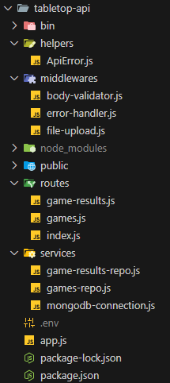

# Estructura y programación del backend

En esta sección describiremos la organización del proyecto `tabletop-api`.

La siguiente imagen recoge el directorio del proyecto



## Dependencias

Como dependencias, a parte de las habituales de un proyecto de express, se requieren:

* `mongodb`: driver oficial de MongoDB para la conexión con la base de datos NoSQL.
* `dotenv`: acceso a variables de entorno del fichero `.env`.
* `express-validator`: implementar validaciones de datos de las solicitudes de clientes.
* `morgan`: logging de solicitudes.
* `multer`: administrar las subidas de archivos de los usuarios.


## Carpeta middlewares

Son una serie de módulos que funcionan como middlewares de la aplicación.

### Middleware `body-validator.js`

El middleware [/middlewares/body-validator.js](https://github.com/bportelalp/master-webdev-uned/blob/main/8-mod-tfm/tabletop-api/middlewares/body-validator.js) se encarga de realizar la validación del cuerpo de las solicitudes, principalmente POST/PUT, de los diferentes controladores de API. Se encarga de que los datos que se espera recibir sean correctos en cantidad y forma.

La implementación usa `express-validator` para definir las normas de validación con su *fluent api*.

### Middleware `error-handler.js`
El middleware [/middlewares/error-handler.js](https://github.com/bportelalp/master-webdev-uned/blob/main/8-mod-tfm/tabletop-api/middlewares/error-handler.js) captura las excepciones controladas de los controladores de API y forma una respuesta de acuerdo con la especificación [RFC 7807 Problem Details](https://datatracker.ietf.org/doc/html/rfc7807).

Para mejorar la calidad de las respuestas, hay una clase de excepción de ayuda, [ApiError](https://github.com/bportelalp/master-webdev-uned/blob/main/8-mod-tfm/tabletop-api/helpers/ApiError.js), que se lanza de distintas partes del programa, y que permite añadir detalles y especificar el *HttpStatusCode* de la forma más precisa posible.

```js
const errorHandler = (err, req, res, next) => {
  debug('Incercepted error:', err)
  const statusCode = err.statusCode || 500;

  let problemDetails = {
    status: statusCode,
    title: err.message,
    type: err.type || undefined,
  };

  if(err.details && Object.keys(err.details).length > 0){
    problemDetails = {
      ...problemDetails,
      ...err.details,
    }
  }

  res.status(statusCode).json(problemDetails);
};

```

### Middleware `file-upload.js`

El middleware [/middlewares/file-upload.js](https://github.com/bportelalp/master-webdev-uned/blob/main/8-mod-tfm/tabletop-api/middlewares/file-upload.js) se encarga de gestionar, ayudado por el paquete `multer`, de subidas de archivos por parte de los usuarios. 

Se usa en el endpoint que permite a los usuarios subir imágenes de los juegos.

## Carpeta Services

Son los "servicios" de la aplicación, entendidos como las dependencias que necesitan los controladores de api para funcionar. Principalmente están relacionados con la capa de acceso a datos.

### Servicio `mongodb-connection.js`
El servicio [/services/mongodb-connection.js](https://github.com/bportelalp/master-webdev-uned/blob/main/8-mod-tfm/tabletop-api/services/mongodb-connection.js) es el servicio base que se centra exclusivamente en administrar la conexión a la base de datos y devuelve el objeto para acceder a sus colecciones.

### Servicio `games-repo.js`

El servicio [/services/games-repo.js](https://github.com/bportelalp/master-webdev-uned/blob/main/8-mod-tfm/tabletop-api/services/games-repo.js) actúa como repositorio para ejecutar los CRUD directamente contra la base de datos.

El módulo exporta los métodos básicos para realizar esas tareas

```js
export default {
  getByFilter,
  getById,
  createGame,
  updateGame,
  updateGameImage,
  deleteById
}
```

Destacamos que todos los errores que se detectan (controlados) en el transcurso de las llamadas se devuelven como una excepción de tipo [ApiError](https://github.com/bportelalp/master-webdev-uned/blob/main/8-mod-tfm/tabletop-api/helpers/ApiError.js). Esta excepción definida `ad-hoc` permite, además del texto de excepción, devolver al cliente más información, puesto que será capturada por el middleware de gestión de errores y construir el resultado en forma de `ProblemDetails`.

### Servicio `game-results-repo.js`

El servicio [/services/game-results-repo.js](https://github.com/bportelalp/master-webdev-uned/blob/main/8-mod-tfm/tabletop-api/services/game-results-repo.js) funciona de forma similar al anterior, pero centrado en las operaciones sobre los resultados de las partidas. La interfaz pública consta de los siguientes métodos:

```js
export default {
    addResult,
    getResults
}
```

## Carpeta Routes

Incluye las rutas propias de la api, explicadas en sus respectivas secciones de este manual. Haz click en los siguientes enlaces para ir a esas secciones.

* [/routes/games.js](3-route-games.md).
* [/routes/game-results.js](4-route-gameResults.md)