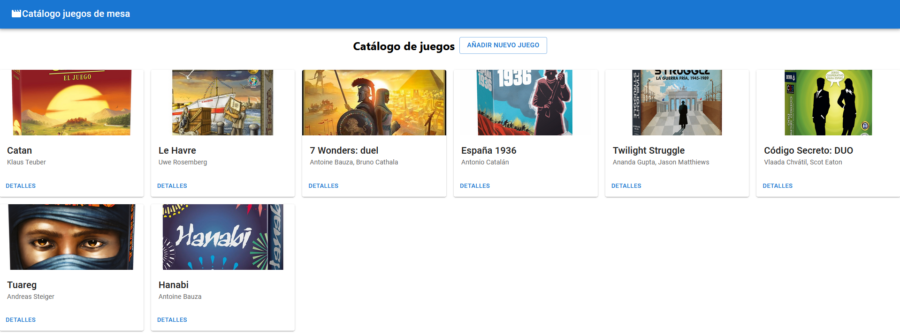
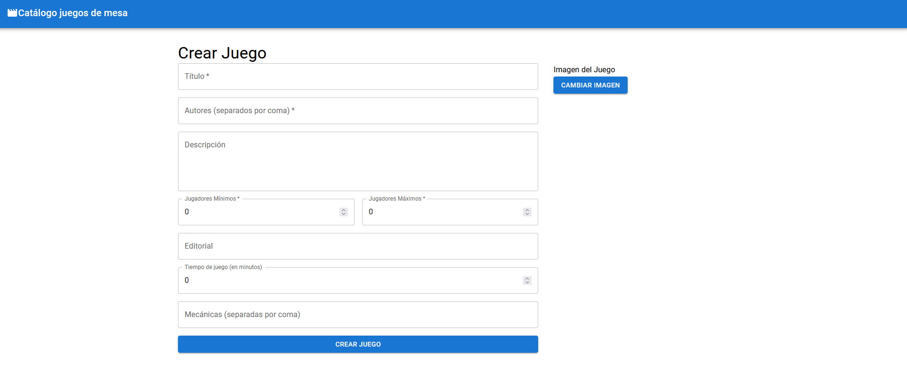
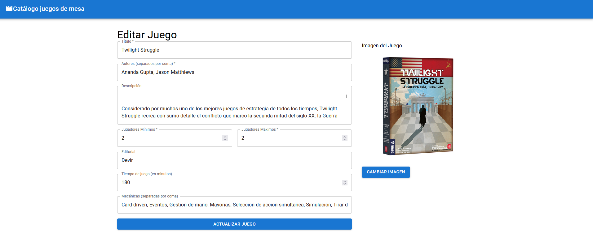
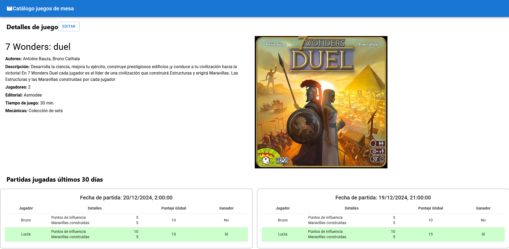

# Funcionalidades del Frontend

Se describen las funciones que tiene la aplicación de react, así como una breve explicación de su interacción con el backend de express.

## Lista de juegos

La página principal tiene un listado de juegos. Esta página usa el hook `useEffect` donde hace la consulta de los juegos disponibles al backend

Podemos usar el botón *Añadir nuevo juego* para acceder al formulario de creación.

Además, cuando hacemos click en detalles, accedemos a la información de cada juego en particular.

## Crear un nuevo juego

Disponible tras hacer click en el botón descrito anteriormente, o mediante acceso a la ruta `/game/edit`, permite añadir un nuevo juego.

En la parte derecha tenemos un bloque de formulario para introducir los campos. A la derecha podemos cargar una imagen para asociarla con el juego.

Al pulsar el botón de *Crear juego* se realiza el registro en dos pasos:

1. Llamada al endpoint `POST api/game`, de manera que se registra el juego.
2. Llamada al endpoint `PUT api/game/:gameId/image`, con el id del juego ya generado, para subir la imagen del juego recientemente creado y asociarlo a el.

## Editar un juego

Se accede al pulsar en los detalles de un juego en la página principal, o directamente con `/game/edit/:gameId`.

Funciona de forma similar al anterior, pero sobre los datos ya existentes.

En este caso, se hacen las siguientes llamadas al usar el botón de *Actualizar juego*

1. Si se ha editado el juego, se invoca `PUT api/game/:gameId`.
2. Si se ha editado la imagen, se invoca a `PUT api/game/:gameId/image`.

## Detalles de juego

Se accede al pulsar en los detalles de un juego en la página principal, o directamente con `/game/:gameId`.

Muestra una ficha de datos de los juegos, así como lista de resultados si hay alguno registrado.

Como se dijo en la introducción, en este prototipo no hay posibilidad de añadir nuevas partidas, pero sí se pueden visualizar las que se han registrado.
