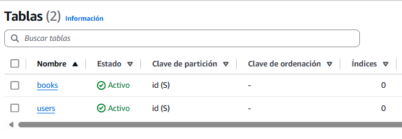
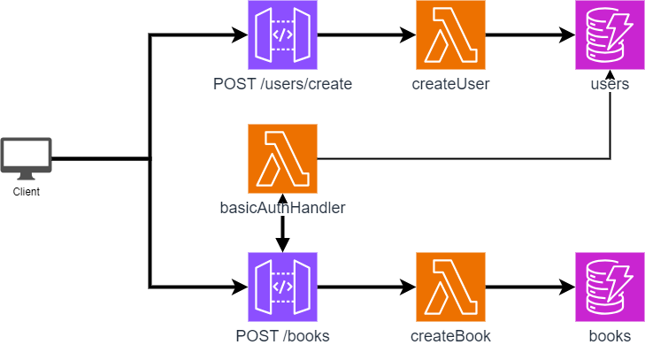
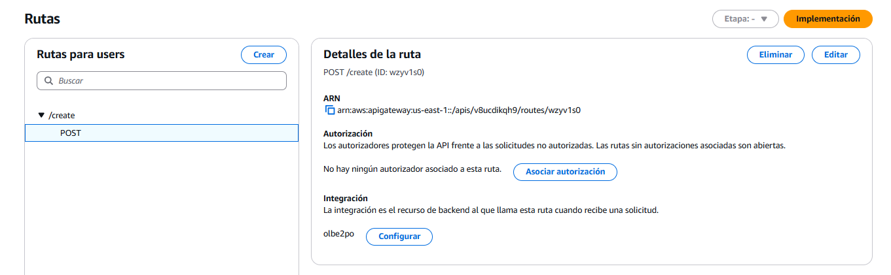
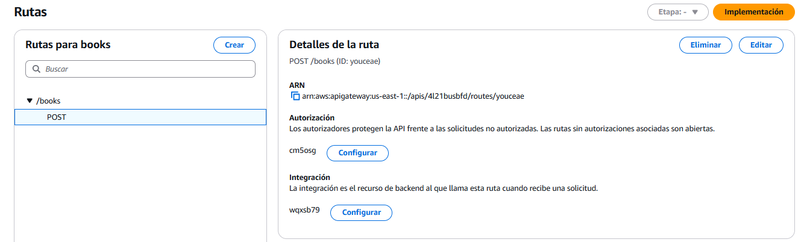
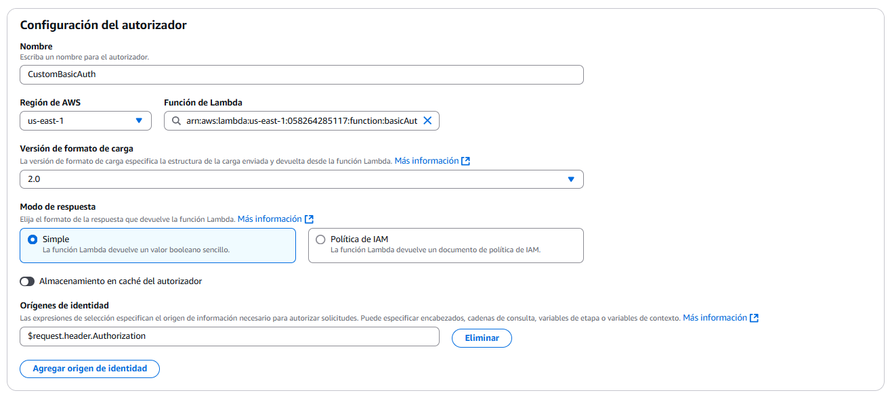

# Despliegue de una aplicación Serverless en AWS

## Enunciado
Sigue las instrucciones del tutorial de AWS para crear una aplicación web serverless con Node.js, Lambda, API Gateway, S3 y DynamoDB.
En el módulo 3 del tutorial, modifica la aplicación web para que haga lo siguiente:
Permita a los usuarios registrarse y crear cuentas.
- Almacene la información del usuario en una tabla DynamoDB.
- Verifique la identidad del usuario antes de permitirle acceder a la aplicación web.

## Propuesta

Tras seguir el tutorial de Amazon (con las limitaciones de AWS Academy) y el vídeo sugerido, se procede a modificar el programa base para añadir las siguientes características.

1. Se crea un endpoint `POST /user/create` para crear usuarios a partir de un `username` y una `password`.
2. Se crea una Lambda para comprobar la autorizacion de solicitudes.
3. Se actualiza un endpoint existente `POST /book` que permitía registrar libros para que antes de nada compruebe la correcta autenticación.

## Estructura DynamoDB

Se crean dos tablas en DynamoDB, una para almacenar los libros y otra para los usuarios.



Esquema `books`:
```json
{
  "id": "<string>",
  "title": "<string>",
  "author": "<string>",
}
```

Esquema `users`:
```json
{
  "id": "<string>",
  "userName": "<string>",
  "passwordHash": "<string>",
}
```

## Estructura flujo

El programa funciona como se muestra en la figura.



1. Una API Gateway con dirección `POST /users/create` permite acceder a una Lambda llamada `createUser` que crea usuarios en la colección `users` de DynamoDB.
1. Una API Gateway con dirección `POST /books` permite acceder a una Lambda llamada `createBook` que crea libros en la colección `books` de DynamoDB.
    - Para acceder a la lambda, primero debe comprobar de forma personalizada que dispone de un encabezado `Authorization` con el tipo `Basic`. Esto lo hace mediante una llamada a `basicAuthHandler` que comprueba si la autorizacion proporcioanda es de un usuario registrado.


### Lambda `createUser`

Crea usuarios. Require de unos datos con el formato siguiente:

```json
{
  "userName": "ElNombreUsuario",
  "password": "LaContraseñaPlana"
}
```

Internamente primero comprueba que no exista un usuario con el mismo nombre. Si todo es correcto, genera el hash de la contraseña que es lo que se guarda en la coleccion de DynamoDB.

A continuación el código usado en esta Lambda.
```js
import { DynamoDBClient } from "@aws-sdk/client-dynamodb";
import { DynamoDBDocumentClient, PutCommand, ScanCommand } from "@aws-sdk/lib-dynamodb";
import crypto from "crypto";

const ddbDocClient = DynamoDBDocumentClient.from(new DynamoDBClient({}));

export const handler = async (event, context) => {
  try {
    const user = JSON.parse(event.body);
    const passwordHash = crypto.createHash('sha256').update(user.password).digest('hex');

    const equivalent = await ddbDocClient.send(new ScanCommand({
      TableName: "users",
      FilterExpression: 'userName = :userName', 
      ExpressionAttributeValues: { ':userName': user.userName  }
    }));


    if(equivalent.Items.length > 0){
      return {
        statusCode: 409,
        body: JSON.stringify(`There is an user with the same username`),
      };
    }

    const newUser = {
      userName: user.userName,
      passwordHash: passwordHash,
      id: crypto.randomUUID(),
    };
    await ddbDocClient.send(new PutCommand({
      TableName: "users",
      Item: newUser,
    }));

    return {
      statusCode: 201,
      body: JSON.stringify(newUser),
    };
  }
  catch (error) {
    console.error(error);
    return {
      statusCode: 500,
      body: JSON.stringify({ message: error.message }),
    };
  }
};
```

#### API Gateway `POST /user/create`

Se configura sin autenticación apuntando a la lambda anteriormente creada.

.


## Lambda `createBook`

Una función sencilla para registrar un libro en DynamoDB.

```js
import { DynamoDBClient } from "@aws-sdk/client-dynamodb";
import { DynamoDBDocumentClient, PutCommand } from "@aws-sdk/lib-dynamodb";
import { randomUUID } from "crypto";

const ddbDocClient = DynamoDBDocumentClient.from(new DynamoDBClient({}));

export const handler = async (event, context) => {
    try {
        const book = JSON.parse(event.body);
        
        const newBook = {
            ...book,
            id: randomUUID(),
        };
        await ddbDocClient.send(new PutCommand({
            TableName: "books",
            Item: newBook,
        }));

        return {
            statusCode: 201,
            body: JSON.stringify(newBook),
        };
    }
    catch (error) {
        console.error(error);
        return {
            statusCode: 500,
            body: JSON.stringify({ message: error.message }),
        };
    }
};
```

## Lambda `basicAuthHandler`

En una autenticación básica, el encabezado `Authorization` tiene el siguiente formato:

```
Basic base64String("UserName:Password")
```

Donde `Base64String` indica que la cadena está codificada en base 64.

De esta forma, un ejemplo de lo que nos podemos encontrar sería algo así:

```
Basic VXNlck5hbWU6cGFzc3dvcmQ=
```

Elaboramos una sencilla lambda que permite extraer los datos de `UserName` y `password` del encabezado y hace la comprobación contra la tabla `users` de DynamoDB si existe un usuario con esos datos.

Como resultado la lambda devuelve un JSON con el formato válido para la autenticación básica de API Gateway

```js
import { DynamoDBClient } from '@aws-sdk/client-dynamodb';
import { DynamoDBDocumentClient, ScanCommand } from '@aws-sdk/lib-dynamodb';
import crypto from "crypto";

const client = new DynamoDBClient({ region: 'us-east-1' });
const ddbDocClient = DynamoDBDocumentClient.from(client);

export const handler = async (event) => {
    const authHeader = event.headers.Authorization || event.headers.authorization;
    if (!authHeader || !authHeader.startsWith('Basic ')) {
        return generateResult(false);
    }

    const encodedCredentials = authHeader.split(' ')[1];
    const [username, password] = Buffer.from(encodedCredentials, 'base64').toString('utf-8').split(':');

    try {
        const params = {
          TableName: "users",
          FilterExpression: 'userName = :userName', 
          ExpressionAttributeValues: { ':userName': username  }
        };

        const passwordHash = crypto.createHash('sha256').update(password).digest('hex');
        console.log("password hashed:", passwordHash);
        const result = await ddbDocClient.send(new ScanCommand(params));
        let user = undefined;
        if(result.Items.length > 0){}
          user = result.Items[0]
        console.log(`Seek user ${username} on DynamoDB: ${JSON.stringify(user)}`);
        if (user && user.passwordHash === passwordHash) {
            return generateResult(true);
        } else {
            return generateResult(false);
        }
    } catch (error) {
        console.error('Error seeking on DynamoDB:', error);
        return generateResult(false);
    }
};

const generateResult = (value) => {
    return  {
        isAuthorized: value,
        context: {
        }
    }
}
```

## API Gateway `POST /books`

Se añade el endpoint para la lambda `createBook`, pero a esta se le añade autenticación mediante invocación a la lambda `basicAuthHandler`:

Endpoint:



Configuración de autorizador:



Se escoge modo de respuesta Simple para no usar roles de IAM en la solicitud. Sólo se comprueba que ese usuario existe y está registrado, es decir, se comprueba sólamente la autenticación correcta.